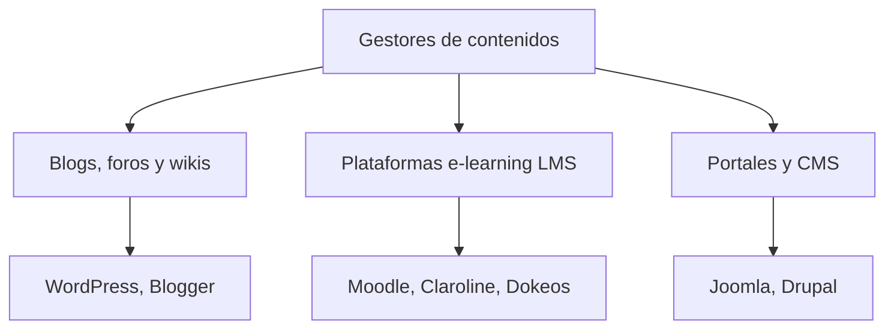
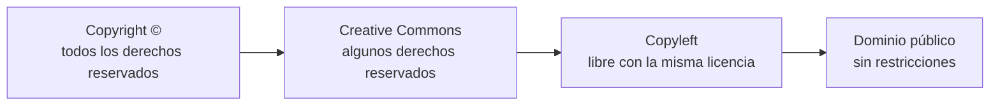
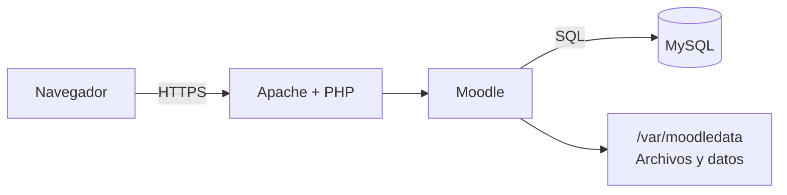
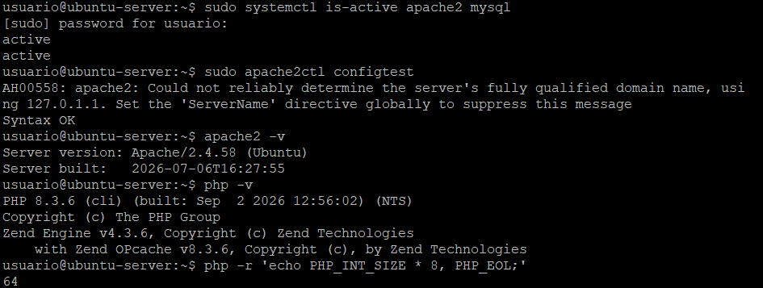
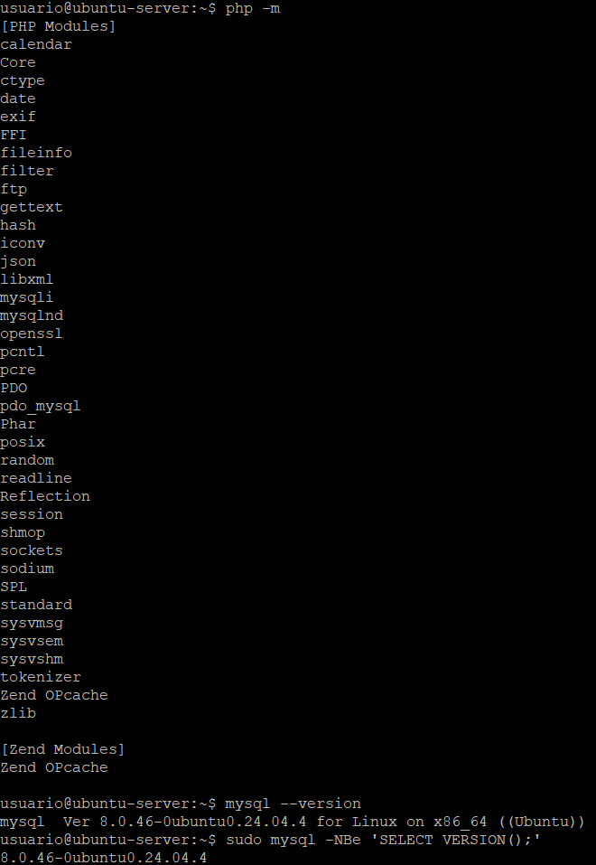
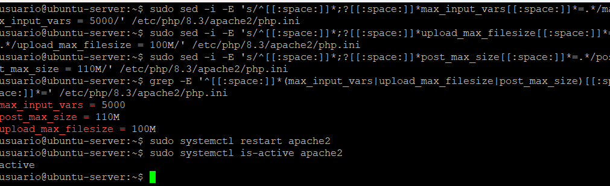
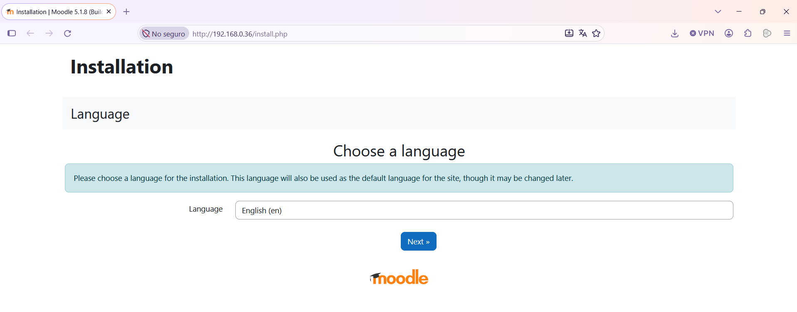
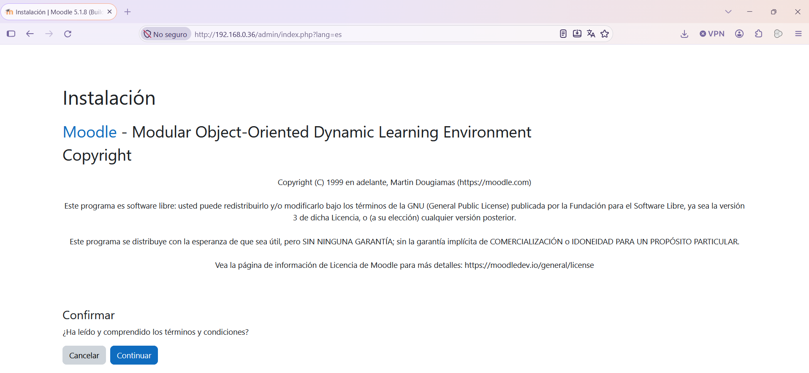

[⌂ Volver al inicio](index.md)

## Índice

- [1. Introducción](#1-introducción)
- [2. Objetivos de la unidad](#2-objetivos-de-la-unidad)
- [3. Criterios de evaluación](#3-criterios-de-evaluación)
- [4. Tipos de gestores de contenidos](#4-tipos-de-gestores-de-contenidos)
- [5. Licencias de uso](#5-licencias-de-uso)
- [6. Moodle y sus requerimientos](#6-moodle-y-sus-requerimientos)
  - [Práctica 1: instalación de LMS](#práctica-1-instalación-de-lms)
- [7. Instalación de Moodle en Ubuntu Server 2404](#7-instalación-de-moodle-en-ubuntu-server-2404)
  - [Práctica 2: instalación de Moodle 5.1 en Ubuntu 24.04](#práctica-2-instalación-de-moodle-51-en-ubuntu-2404)
- [8. Estructura de Moodle](#8-estructura-de-moodle)
- [9. Creación de contenidos](#9-creación-de-contenidos)
- [10. Personalización de la interfaz](#10-personalización-de-la-interfaz)
  - [Práctica 3: personalización del tema y saludo en PHP](#103-práctica-3-personalización-del-tema-y-saludo-en-php)
- [11. Mecanismos de seguridad](#11-mecanismos-de-seguridad)
- [12. Verificación y rendimiento](#12-verificación-y-rendimiento)
- [13. Publicación](#13-publicación)
- [14. Proyecto práctico final](#14-proyecto-práctico-final)
- [15. Fuentes y documentación](#15-fuentes-y-documentación)

---

## 1. Introducción

Un gestor de contenidos (CMS, *Content Management System*) permite crear, organizar y publicar información desde una interfaz web, sin tener que programar cada página desde cero. En esta unidad implantaremos **Moodle**, un gestor de aprendizaje (LMS, *Learning Management System*), en **Ubuntu Server 24.04 LTS**.

Moodle permite organizar cursos, matricular participantes, publicar recursos, proponer actividades y evaluar el aprendizaje. Para que funcione necesita un servidor web, PHP, una base de datos y un directorio de datos separado del código de la aplicación.

La práctica utilizará la pila Apache, PHP y MySQL. Las versiones concretas de Moodle y sus dependencias deben comprobarse en la documentación oficial antes de cada despliegue: no se debe asumir que una versión antigua sigue recibiendo actualizaciones de seguridad.

## 2. Objetivos de la unidad

- Diferenciar los principales tipos de gestores de contenidos y elegir uno según su finalidad.
- Interpretar las licencias de uso de una aplicación y de sus contenidos.
- Identificar los requisitos de funcionamiento de Moodle.
- Instalar y configurar Moodle en Ubuntu Server 24.04.
- Crear una base de datos y comprender la estructura de directorios de Moodle.
- Crear un curso con recursos y actividades, y adaptar su apariencia.
- Crear un complemento local sencillo en PHP y visualizar su salida dentro de Moodle.
- Aplicar medidas de seguridad, comprobar el funcionamiento y valorar el rendimiento.
- Publicar la plataforma de forma segura y documentar el proceso.

## 3. Criterios de evaluación

Se evaluará que el alumnado sea capaz de:

- Clasificar gestores de contenidos y justificar la elección de Moodle para un entorno educativo.
- Explicar las licencias del software y respetar las condiciones de reutilización de materiales.
- Relacionar Apache, PHP, MySQL, Moodle y el directorio de datos.
- Instalar la aplicación, crear su base de datos y completar su configuración.
- Organizar un curso y añadir contenidos y actividades coherentes.
- Crear una página sencilla mediante un complemento local, usando la API de Moodle y controlando el acceso.
- Personalizar la interfaz sin comprometer la actualización del sistema.
- Aplicar controles básicos de seguridad y realizar pruebas funcionales y de rendimiento.
- Publicar la plataforma mediante HTTPS y aportar evidencias del trabajo realizado.

## 4. Tipos de gestores de contenidos

Los CMS se pueden clasificar atendiendo al uso que se hace de ellos:

| Tipo | Finalidad | Ejemplos |
| --- | --- | --- |
| CMS generalista | Sitios web, noticias, páginas y blogs | WordPress, Drupal, Joomla |
| LMS o gestor de aprendizaje | Cursos, usuarios, actividades y evaluación | Moodle, Canvas |
| Gestor documental | Almacenamiento, clasificación y flujo de documentos | Alfresco, SharePoint |
| CMS desacoplado o *headless* | Gestiona contenidos y los entrega mediante una API a distintos clientes | Strapi, Directus |



### Blogs, foros y wikis


*Logotipo de WordPress, uno de los gestores de blogs más usados. Fuente: Wikimedia Commons.*

- **Blogs:** sitios web en los que se publican artículos de uno o varios autores en orden cronológico inverso. Los lectores pueden comentar cada entrada y es habitual ofrecer sindicación mediante RSS o Atom. Pueden usarse servicios con alojamiento gratuito (Blogger, WordPress.com) o instalarse en un servidor propio (WordPress), lo que da control total pero exige disponer de ese servidor.
- **Foros:** espacios para compartir opiniones y formar comunidades en torno a un interés. Se diferencian de los blogs en que admiten más usuarios y las conversaciones se anidan. WordPress, Joomla o Moodle incluyen foros propios.
- **Wikis:** sitios cuyas páginas pueden ser editadas por varios usuarios desde el navegador. Guardan un historial de cambios que permite recuperar versiones anteriores e identificar al autor de cada modificación. Sus páginas se escriben en wikitexto y se enlazan entre sí, una estructura más sencilla que una base de datos.

### Plataformas de e-learning


*Logotipo de Moodle. Fuente: Wikimedia Commons.*


Son gestores de contenidos orientados a la gestión de cursos. Incluyen herramientas de comunicación y colaboración entre los participantes, así como cuestionarios y tareas para valorar su aprendizaje. Son una de las soluciones más usadas en la educación semipresencial y a distancia. Ejemplos: Moodle, Claroline, Dokeos o WebCT.

### Portales y gestores de contenidos (CMS)

Los portales de contenidos son sitios de gran envergadura con funciones variadas, como los de un periódico: noticias, anuncios, repositorios de documentos, blogs, foros, ofertas de empleo o información meteorológica. Gestores como Joomla o Drupal permiten crearlos y administrarlos sin grandes conocimientos de programación web.

Moodle es un LMS: además de publicar páginas, organiza el aprendizaje en cursos y ofrece herramientas de matriculación, seguimiento, comunicación y evaluación. La elección debe basarse en el propósito, el número de usuarios, las integraciones, los conocimientos de administración y los recursos disponibles.

## 5. Licencias de uso

Una licencia establece qué se puede hacer con un programa o con una obra. No se debe confundir que un producto sea gratuito con que carezca de licencia o de condiciones de uso.

- **Software propietario:** el titular conserva el control del código y concede permisos de uso bajo unas condiciones determinadas.
- **Software libre:** permite, conforme a su licencia, usar, estudiar, modificar y redistribuir el programa.
- **Software de código abierto:** ofrece acceso al código y permisos de uso definidos por su licencia; hay que leer las condiciones concretas de cada proyecto.

Moodle se distribuye bajo la licencia **GNU GPL versión 3 o posterior**. Esta licencia permite usar y modificar el programa y redistribuirlo respetando sus condiciones. Los temas, complementos y materiales educativos pueden tener licencias diferentes: hay que comprobarlas por separado. Para contenidos educativos pueden emplearse licencias Creative Commons, que especifican condiciones como atribución, uso no comercial o compartir con la misma licencia.

### La licencia de uso

La licencia es el documento con el que el autor expresa los límites y el alcance del uso que se puede hacer de su obra: copia, reproducción, modificación, traducción y adaptación. Debe especificar, al menos, qué se permite en cuanto a:

- Reproducción o copia.
- Realización de obras derivadas o adaptaciones.
- Beneficio económico.

Las licencias van desde las más restrictivas, en las que el autor se reserva todos los derechos, hasta las más permisivas, cuyo caso extremo es el dominio público. En todas se respetan los **derechos morales**: nadie puede atribuirse la autoría de una obra que no ha creado y, si se conoce al autor, hay que citarlo.

### Tipos de licencias



*De la licencia más restrictiva (izquierda) a la más permisiva (derecha). Las licencias CC abarcan un rango amplio según las condiciones elegidas.*


*Símbolos de copyright, copyleft y Creative Commons. Fuente: Wikimedia Commons.*

- **Copyright (©):** el autor se reserva todos los derechos.
- **Copyleft:** permite la libre distribución de copias y versiones modificadas, exigiendo que las obras derivadas mantengan los mismos derechos. Nació con el software libre, cuyo autor incluye el código fuente para que se use, modifique y distribuya. Puede ser *completa* (permite cualquier modificación excepto cambiar la licencia) o *parcial* (limita las partes modificables).
- **Creative Commons (CC):** suelen usarse para contenidos más que para software y siguen el lema «algunos derechos reservados». El autor elige qué derechos cede de entre los que posee.

En todas las licencias CC se presupone que el autor concede los derechos de copia y distribución. Sobre esa base, se combinan estas condiciones:

| Condición | Significado |
| --- | --- |
| Reconocimiento (*Attribution*) | Se permite copiar, distribuir y comunicar la obra y sus derivadas siempre que se cite al autor original. |
| No comercial (*Non-Commercial*) | Se permite su uso siempre que no tenga fines comerciales. |
| Sin obras derivadas (*No Derivatives*) | Se permite copiar y distribuir la obra original, pero no crear trabajos derivados. |
| Compartir igual (*Share Alike*) | Se permiten obras derivadas siempre que se distribuyan con una licencia idéntica a la original. |

Una obra con licencia copyleft completa cumple *share-alike*, pero una obra *share-alike* no tiene por qué ser copyleft completa: si tiene algún derecho restringido, sería copyleft parcial. Las licencias CC se han adaptado a la legislación de distintos países mediante el proyecto iCommons (International Commons).

Hay que ser consciente de las implicaciones legales del software que se usa. En el mejor de los casos, incumplir una licencia obliga a desinstalar el programa o pagar por su uso, pero también existen multas por incumplimiento.

Antes de instalar un complemento o publicar un recurso, se debe verificar su procedencia, licencia, compatibilidad con la versión instalada y política de actualizaciones.

### **Práctica 1:** instalación de LMS

Existen otros LMS de código abierto o con edición gratuita. Elige **uno** de la siguiente lista:

La columna **Nota máxima** indica el límite de nota para cada LMS según la dificultad relativa de su instalación en Windows y la investigación que requiere. La nota obtenida dentro de ese límite dependerá de la calidad de la investigación, la instalación, las pruebas y la documentación. El LMS con el reto de instalación mayor permite optar a 10 puntos.

| LMS | Tecnología | Descarga para Windows | Guía de instalación paso a paso | Nota máxima |
| --- | --- | --- | --- | ---: |
| **Chamilo** | PHP + MySQL/MariaDB | [Descargar Chamilo](https://chamilo.org/en/download/) | [Ver guía (XAMPP)](https://docs.chamilo.org/administration-guide/admin-guide/installation) | 7 |
| **Open edX (Tutor)** | Python + Docker | [Descargar Tutor](https://docs.tutor.edly.io/install.html) | [Ver guía (WSL2 y Docker)](https://discuss.openedx.org/t/how-to-install-openedx-v20-with-tutor-on-windows-os-with-wsl2/17417) | 9 |
| **Canvas LMS** (Community) | Ruby on Rails + PostgreSQL | [Quick Start / Descarga](https://github.com/instructure/canvas-lms/wiki/Quick-Start) | [Ver guía (Docker)](https://github.com/instructure/canvas-lms/wiki/Quick-Start) | 9 |
| **ILIAS** | PHP + MySQL/MariaDB | [Descargar ILIAS](https://www.ilias.de/en/download/) | [Tutorial](https://iliastutorials.com/faq/how-to-install-ilias/) / [Guía Oficial](https://github.com/ILIAS-eLearning/ILIAS/blob/release_11/docs/configuration/install.md) | 8 |
| **Sakai** | Java | [Descargar Sakai](https://www.sakailms.org/download/) | [Guía Oficial](https://sakaiproject.atlassian.net/wiki/spaces/DOC/pages/32201507113/Sakai+22+Install+Guide+Source) | 10 |
| **Opigno LMS** | Drupal (PHP) | [Descargar Opigno](https://www.opigno.org/en/download) | [Ver guía](https://www.valuebound.com/resources/blog/how-install-opigno-lms) | 8 |

Las guías de ILIAS y Chamilo parten de un servidor local; puedes montarlo con XAMPP (https://www.apachefriends.org/download.html). Algunos LMS no tienen instalador para Windows y se ejecutan con Docker Desktop o con un servidor local como XAMPP. Los enlaces pueden cambiar: si alguno no funciona, búscalo desde la web oficial del proyecto.

**Investiga y documenta:**

1. Licencia exacta, versión estable actual y fecha de la última publicación.
2. Requisitos de software y hardware. Tenoclogías sobre las que trabaja.
3. Funcionalidades principales: cursos, tareas, cuestionarios, foros y calificaciones.
4. Comparativa con otros LMS: ventajas, inconvenientes, comunidad y documentación.

**Instalación y comprobación en Windows:**

1. Elige un método de instalación compatible con Windows: instalador oficial, paquete de servidor local (XAMPP o WampServer, para los LMS en PHP) o Docker Desktop. Justifica tu elección.
2. Instala el LMS en tu equipo siguiendo la documentación oficial y anota los pasos y los problemas encontrados. Documenta la instalación paso a paso.
3. Comprueba su funcionamiento:
   - Accede como administrador.
   - Crea un curso con al menos un recurso y una tarea o cuestionario.
   - Crea un usuario alumno, matricúlalo y accede con él para realizar la actividad.
4. Si el LMS no es compatible con Windows de forma directa, indica el motivo y la alternativa que has usado.

**Entrega:** un informe con la investigación, capturas de pantalla de la instalación y de cada comprobación, y una conclusión sobre en qué casos elegirías este LMS.

## 6. Moodle y sus requerimientos

### 6.1 Arquitectura

En nuestra instalación, el navegador solicita una página a Apache. Apache entrega los archivos estáticos o deriva la ejecución de PHP. Moodle ejecuta la lógica de la petición y consulta MySQL para leer o guardar información. Los archivos subidos y otros datos se guardan en un directorio independiente, fuera de la zona pública del servidor web.



### 6.2 Requisitos

Para **Moodle 5.1**, los requisitos mínimos relevantes para esta práctica son:

| Componente | Requisito de Moodle 5.1 | Situación en Ubuntu Server 24.04 |
| --- | --- | --- |
| Sistema | Sistema actualizado y PHP de 64 bits | Ubuntu Server 24.04 LTS es adecuado |
| PHP | Mínimo 8.2.0; se admiten PHP 8.3 y 8.4 | La versión predeterminada es PHP 8.3, compatible |
| Extensión PHP | `sodium` es obligatoria; también se necesitan las extensiones habituales de Moodle | Comprueba las extensiones instaladas para PHP de Apache y CLI |
| Configuración PHP | `max_input_vars` debe ser al menos `5000` | Ajustar en la configuración de PHP usada por Apache |
| Base de datos | MySQL 8.4 como mínimo | Comprueba la versión instalada; MySQL 8.0 no cumple este requisito |
| Codificación de la base de datos | `utf8mb4` | Se configura al crear la base de datos |
| Servidor web | Apache es compatible | Apache HTTP Server está disponible en los repositorios |
| Red para publicación | Dominio y HTTPS para acceso público | Necesita DNS, conectividad entrante y certificado TLS |

Comprueba las versiones realmente instaladas antes de continuar: `php -v` y `mysql --version`; confirma la versión del servidor con `mysql -NBe 'SELECT VERSION();'`. Moodle 5.1 requiere MySQL 8.4 o posterior: si tienes MySQL 8.0, actualízalo antes de instalar Moodle. Verifica también que el PHP de 64 bits está instalado (`php -r 'echo PHP_INT_SIZE * 8, PHP_EOL;'`, que debe mostrar `64`) y que Sodium está disponible (`php -m | grep -i sodium`). Estas comprobaciones de terminal verifican el PHP CLI; el instalador de Moodle permite revisar el PHP que carga Apache. Para un servidor real, dimensiona CPU, memoria y almacenamiento según usuarios concurrentes y volumen de archivos: Moodle no establece una cifra única válida para todos los centros.

## 7. Instalación de Moodle en Ubuntu Server 24.04

La siguiente práctica es una base para un entorno de laboratorio. En producción se debe elegir una rama de Moodle que continúe recibiendo actualizaciones, aplicar HTTPS y adaptar la capacidad del servidor.

### 7.1 Comprobar, actualizar e instalar los servicios necesarios

### Comprobación de servicios y paquetes necesarios

Antes de instalar nada, comprueba Apache, PHP y MySQL, que ya están instalados en este servidor. Así evitarás reinstalar servicios que ya funcionan:

```bash
sudo apt update
sudo apt upgrade
sudo systemctl is-active apache2 mysql
sudo apache2ctl configtest
apache2 -v
php -v
php -r 'echo PHP_INT_SIZE * 8, PHP_EOL;'
php -m
mysql --version
sudo mysql -NBe 'SELECT VERSION();'
```



Apache y MySQL deben aparecer como `active` y la prueba de Apache debe indicar `Syntax OK`. PHP debe ser de 64 bits y tener, como mínimo, las extensiones `curl`, `gd`, `intl`, `mbstring`, `mysqli`, `soap`, `xml`, `zip`, `Zend OPcache` y `sodium`. Comprueba también si están instalados los paquetes requeridos:

```bash
dpkg -s apache2 git php libapache2-mod-php php-cli php-mysql \
	php-xml php-curl php-gd php-intl php-mbstring php-soap \
	php-zip php-opcache
```

Si `dpkg -s` indica que falta algún paquete de esta lista, ejecuta el siguiente comando. `apt` instalará los que falten y mantendrá los que ya estén instalados:

```bash
sudo apt install apache2 git \
	php libapache2-mod-php php-cli php-mysql php-xml php-curl \
	php-gd php-intl php-mbstring php-soap php-zip php-opcache
```

Si Apache no está instalado, el comando anterior lo instalará. No instales de nuevo MySQL si ya está presente. 

### Actualización de MySQL a la versión 8.4

Moodle 5.1 requiere MySQL 8.4 o posterior. Como esta instalación está recién hecha y no contiene datos que quieras conservar, puedes actualizar MySQL 8.0 directamente desde el repositorio APT oficial de Oracle. Estos comandos descargan el paquete oficial `mysql-apt-config_0.8.40-1_all.deb` y configuran el repositorio:

```bash
wget https://dev.mysql.com/get/mysql-apt-config_0.8.40-1_all.deb
sudo dpkg -i mysql-apt-config_0.8.40-1_all.deb
```

En el menú, selecciona **1. MySQL Server & Cluster** y pulsa Intro. En la siguiente lista selecciona **3. mysql-8.4-lts** y pulsa Intro. Al volver al menú inicial, selecciona **3. Ok** y pulsa Intro para guardar y salir; no vuelvas a entrar en la opción 1. Luego ejecuta estos comandos para comprobar que APT propone MySQL 8.4 e instalar la actualización:

```bash
sudo apt update
apt-cache policy mysql-server
```

En la salida, confirma que `Candidate` empieza por `8.4`. Si muestra otra versión, no continúes: vuelve a configurar el repositorio con `sudo dpkg-reconfigure mysql-apt-config` y selecciona **mysql-8.4-lts**. Si indica 8.4, actualiza e inicia el servicio:

```bash
sudo apt install mysql-server
sudo systemctl enable --now mysql
```

Al terminar, confirma la versión del servidor y que el servicio está activo:

```bash
sudo systemctl status mysql --no-pager
sudo mysql -NBe 'SELECT VERSION();'
```

La versión debe ser 8.4 o posterior antes de continuar con Moodle. Si MySQL no arranca, consulta el registro con `sudo journalctl -u mysql -n 100 --no-pager`.

### Inicio de los servicios

Cuando los servicios estén instalados, habilítalos e inicia los que estuvieran inactivos:

```bash
sudo systemctl enable --now apache2 mysql
```

### Configuración de PHP para Moodle

En Ubuntu 24.04, la configuración de PHP 8.3 para Apache está en `/etc/php/8.3/apache2/php.ini`. En estos pasos se permitirá subir archivos de hasta `100M`; `post_max_size` se establece en `110M` para incluir también los datos adicionales de la petición. Si necesitas otro límite, sustituye esos valores por los que quieras usar, manteniendo `post_max_size` igual o superior a `upload_max_filesize`.

Establece `max_input_vars` en `5000`, el mínimo recomendado para Moodle:

```bash
sudo sed -i -E 's/^[[:space:]]*;?[[:space:]]*max_input_vars[[:space:]]*=.*/max_input_vars = 5000/' /etc/php/8.3/apache2/php.ini
```

Establece el tamaño máximo de cada archivo subido en `100M`:

```bash
sudo sed -i -E 's/^[[:space:]]*;?[[:space:]]*upload_max_filesize[[:space:]]*=.*/upload_max_filesize = 100M/' /etc/php/8.3/apache2/php.ini
```

Establece el tamaño máximo total de los datos enviados en una petición en `110M`:

```bash
sudo sed -i -E 's/^[[:space:]]*;?[[:space:]]*post_max_size[[:space:]]*=.*/post_max_size = 110M/' /etc/php/8.3/apache2/php.ini
```

Comprueba que los tres valores han quedado configurados:

```bash
grep -E '^[[:space:]]*(max_input_vars|upload_max_filesize|post_max_size)[[:space:]]*=' /etc/php/8.3/apache2/php.ini
```

La salida debe incluir `max_input_vars = 5000`, `upload_max_filesize = 100M` y `post_max_size = 110M`.



Reinicia Apache para que PHP cargue la nueva configuración:

```bash
sudo systemctl restart apache2
```

Por último, confirma que Apache sigue activo:

```bash
sudo systemctl is-active apache2
```

El resultado esperado es `active`.

### 7.2 Crear la base de datos

Accede a MySQL como administrador local:

```bash
sudo mysql
```

En el indicador de MySQL, crea una base de datos y un usuario exclusivos para Moodle. Sustituye la contraseña de ejemplo por una contraseña robusta y única; no la publiques ni la reutilices.

```sql
CREATE DATABASE moodle
	DEFAULT CHARACTER SET utf8mb4
	COLLATE utf8mb4_unicode_ci;
CREATE USER 'moodleuser'@'localhost' IDENTIFIED BY 'CAMBIAR_POR_UN_SECRETO_ROBUSTO';
GRANT ALL PRIVILEGES ON moodle.* TO 'moodleuser'@'localhost';
FLUSH PRIVILEGES;
EXIT;
```

La aplicación debe conectarse con `moodleuser`, no con el usuario administrador de MySQL. Limitar el usuario a `localhost` reduce las conexiones desde otros equipos.

### 7.3 Descargar Moodle y preparar los directorios

En este apartado se descargará Moodle 5.1. La palabra *rama* indica la línea de desarrollo que se descarga; `MOODLE_501_STABLE` es la rama estable de Moodle 5.1. Asegúrate de que la versión de Moodle elegida sigue mantenida y es compatible con PHP y MySQL antes de continuar.

Comprueba que Git está disponible:

```bash
git --version
```

Descarga el código de Moodle en `/var/www/moodle`. Ejecuta este comando una sola vez; si el directorio ya existe porque el comando se ejecutó antes, no lo repitas:

```bash
sudo git clone --branch MOODLE_501_STABLE https://github.com/moodle/moodle.git /var/www/moodle
```

Comprueba que se ha descargado la rama correcta y que existe el directorio público que Apache utilizará:

```bash
git -C /var/www/moodle branch --show-current
```

El resultado esperado es `MOODLE_501_STABLE`. Comprueba ahora que existe `public`:

```bash
test -d /var/www/moodle/public && echo "Directorio public encontrado"
```

Asigna el código a `root` y al grupo `www-data`. De este modo Apache podrá leerlo, pero no modificarlo:

```bash
sudo chown -R root:www-data /var/www/moodle
```

Comprueba el propietario y los permisos del directorio:

```bash
ls -ld /var/www/moodle
```

El resultado debe ser similar a este; el número, la fecha y el tamaño variarán:

```text
drwxr-xr-x 1x root www-data 4096 oct  4 10:35 /var/www/moodle
```

Comprueba que el propietario es `root`, el grupo es `www-data` y los permisos son `drwxr-xr-x`. Si el grupo es `root`, vuelve a ejecutar el comando `chown`.

Crea `/var/moodledata`, donde Moodle guardará archivos de usuarios y cursos. Esta carpeta queda fuera del directorio público de Apache y solo el servicio web y el administrador podrán acceder a ella:

```bash
sudo install -d -o www-data -g www-data -m 770 /var/moodledata
```

Comprueba que se creó con el propietario y los permisos esperados:

```bash
ls -ld /var/moodledata
```

El resultado debe mostrar `www-data` como propietario y grupo, y permisos `drwxrwx---`. No coloques `moodledata` dentro de `/var/www/moodle` ni de `/var/www/moodle/public`.

### 7.4 Configurar Apache

En Moodle 5.1, el directorio `public` es la raíz web. De esta forma no se exponen directamente al navegador otros archivos del código fuente. Si utilizas otra rama, sigue las instrucciones de instalación correspondientes a esa versión.

#### Paso 1. Averiguar la IP del servidor

Si no tienes un nombre DNS, accederás a Moodle mediante la IP de la máquina. Anótala:

```bash
hostname -I
```

#### Paso 2. Crear el archivo del sitio

Abre un archivo nuevo con el editor `nano`:

```bash
sudo nano /etc/apache2/sites-available/moodle.conf
```

Pega este contenido. Sustituye `192.168.0.36` por la IP del paso 1 si es distinta (también sirve un nombre DNS del laboratorio):

```apache
<VirtualHost *:80>
    ServerName 192.168.0.36
    DocumentRoot /var/www/moodle/public

    <Directory /var/www/moodle/public>
        AllowOverride None
        Options FollowSymLinks
        Require all granted
    </Directory>

    ErrorLog ${APACHE_LOG_DIR}/moodle_error.log
    CustomLog ${APACHE_LOG_DIR}/moodle_access.log combined
</VirtualHost>
```

Guarda con `Ctrl+O`, pulsa `Enter` y sal con `Ctrl+X`.

#### Paso 3. Comprobar que el archivo se ha guardado

```bash
cat /etc/apache2/sites-available/moodle.conf
```

#### Paso 4. Activar el módulo `rewrite`

```bash
sudo a2enmod rewrite
```

#### Paso 5. Activar el sitio de Moodle

```bash
sudo a2ensite moodle.conf
```

#### Paso 6. Desactivar el sitio por defecto

Así Apache no muestra la página de bienvenida en lugar de Moodle:

```bash
sudo a2dissite 000-default.conf
```

#### Paso 7. Comprobar la configuración

```bash
sudo apache2ctl configtest
```

Debe mostrar `Syntax OK`. Puede aparecer antes un aviso sobre `ServerName`, que no es un error. Si aparece otro mensaje de error, revisa el archivo del paso 2.

#### Paso 8. Aplicar los cambios

```bash
sudo systemctl reload apache2
```

#### Paso 9. Comprobar que Apache responde

```bash
sudo systemctl is-active apache2
curl -I http://localhost
```

El primer comando debe mostrar `active`. El segundo debe devolver una respuesta `HTTP/1.1 200 OK` o `302 Found`, que indica que Apache sirve Moodle.

### 7.5 Completar la instalación

#### Acceder desde el host de Windows

La instalación se hace desde el navegador del equipo Windows (el host) que ejecuta la máquina virtual. Sigue estos pasos:

1. **Comprueba la IP de la VM.** En la VM ejecuta `hostname -I`. En este laboratorio es `192.168.0.36`.
2. **Comprueba que el host llega a la VM.** En PowerShell de Windows:

   ```powershell
   ping 192.168.0.36
   ```

   Deben aparecer respuestas (`Respuesta desde 192.168.0.36`). Si no responde, la VM debe tener la red en **modo puente** (*bridge*), de modo que esté en la misma red que el host. Con NAT, el host no ve la IP de la VM sin reenviar puertos.
3. **Comprueba que el puerto 80 está accesible.** En PowerShell:

   ```powershell
   Test-NetConnection 192.168.0.36 -Port 80
   ```

   Debe mostrar `TcpTestSucceeded : True`. Si da `False`, comprueba que Apache está activo en la VM (`sudo systemctl is-active apache2`) y que el cortafuegos no bloquea el puerto (`sudo ufw status`; si está activo, `sudo ufw allow 80/tcp`).
4. **Abre el navegador** del host y escribe en la barra de direcciones `http://192.168.0.36`. Debe cargarse el instalador de Moodle. Usa la misma IP que pusiste en `ServerName` del apartado 7.4; si accedes con otra dirección, Moodle puede mostrar un error o redirigir.



5. **Opcional: usar un nombre en lugar de la IP.** Si prefieres `moodle.ejemplo.local`, cambia `ServerName` en el 7.4 por ese nombre y, en Windows, añade la línea `192.168.0.36 moodle.ejemplo.local` al archivo `C:\Windows\System32\drivers\etc\hosts`. Para editarlo, abre el Bloc de notas **como administrador**. Después accede a `http://moodle.ejemplo.local`.

#### Datos del instalador

Sigue el instalador. Selecciona el idioma, confirma las rutas y proporciona los datos de conexión a MySQL:

- Tipo de base de datos: MySQL mejorado (controlador `mysqli`).
- Servidor: `localhost`.
- Base de datos: `moodle`.
- Usuario: `moodleuser`.
- Contraseña: la definida al crear el usuario.
- Directorio de datos: `/var/moodledata`. El instalador propone `/var/www/moodledata`: cámbialo por `/var/moodledata`, que es el directorio creado en el apartado 7.3.

#### Crear el archivo `config.php` a mano

Al terminar la configuración, Moodle muestra la pantalla «Configuración finalizada» con el contenido del archivo `config.php`. Moodle no puede crearlo por sí mismo porque `/var/www/moodle` pertenece a `root` y Apache (`www-data`) no tiene permiso de escritura. Es lo esperado y lo más seguro, así que debes crearlo tú.

1. Abre el archivo en la raíz de Moodle (no en `public`):

   ```bash
   sudo nano /var/www/moodle/config.php
   ```

2. Pega el contenido que muestra el instalador, desde `<?php` hasta `require_once(__DIR__ . '/lib/setup.php');`. Guarda con `Ctrl+O`, `Enter` y sal con `Ctrl+X`.

3. Comprueba que se ha guardado correctamente. La primera línea debe ser `<?php  // Moodle configuration file`:

   ```bash
   head -n 5 /var/www/moodle/config.php
   ```

4. El archivo contiene la contraseña de la base de datos: asigna propietario y permisos para que Apache solo pueda leerlo:

   ```bash
   sudo chown root:www-data /var/www/moodle/config.php
   sudo chmod 640 /var/www/moodle/config.php
   ```

5. Verifica el resultado. Debe mostrar `-rw-r----- 1 root www-data`:

   ```bash
   ls -l /var/www/moodle/config.php
   ```

6. Vuelve al navegador y pulsa el botón para continuar, o recarga `http://192.168.0.36`. Moodle detectará `config.php` y seguirá con las comprobaciones y la creación de tablas, que tarda varios minutos. No cierres ni recargues la página mientras avanza.

Completa la configuración del sitio y crea una cuenta de administración con una contraseña única. No reutilices las credenciales de la base de datos. Al finalizar, verifica que Moodle recomienda eliminar o proteger el instalador y que el directorio de datos no es accesible mediante una URL.



### 7.6 Configurar las tareas programadas

Moodle necesita ejecutar tareas periódicas para enviar notificaciones, procesar tareas y mantener el sitio. Configura el cron para que se ejecute cada minuto como `www-data`.

> **Aclaración:** si `sudo crontab` responde `crontab: command not found`, el servicio `cron` no está instalado. Instálalo y actívalo antes de continuar:
>
> ```bash
> sudo apt install -y cron
> sudo systemctl enable --now cron
> sudo systemctl is-active cron
> ```
>
> El último comando debe mostrar `active`.

Edita el cron del usuario `www-data` (la primera vez te pide elegir un editor; elige `nano`):

```bash
sudo crontab -u www-data -e
```

Añade esta línea, guarda con `Ctrl+O`, `Enter` y sal con `Ctrl+X`:

```cron
* * * * * /usr/bin/php /var/www/moodle/admin/cli/cron.php >/dev/null
```

Comprueba que se ha guardado:

```bash
sudo crontab -u www-data -l
```

En el área de administración, comprueba después que la última ejecución del cron es reciente y que no hay tareas atascadas.

### 7.7 **Práctica 2:** instalación de Moodle 5.1 en Ubuntu 24.04

**Enunciado**

Despliega Moodle 5.1 en una máquina virtual con Ubuntu Server 24.04 LTS y deja la plataforma operativa y accesible desde el equipo anfitrión. Utiliza como guía los pasos de instalación de este apartado y consulta la documentación oficial para comprobar los requisitos y las versiones compatibles.

Entrega una memoria que incluya:

- Las características de la máquina virtual y la configuración de red utilizada, sin incluir contraseñas ni otros datos sensibles.
- Los pasos y comandos principales para instalar y configurar Apache, PHP, MySQL y Moodle.
- La configuración de la base de datos y de `moodledata`, explicando cómo se evita que los datos y archivos sensibles queden expuestos por HTTP.
- Evidencias de acceso a Moodle, de la creación de la cuenta administradora y de la ejecución correcta de las tareas programadas.
- Las comprobaciones realizadas y los problemas encontrados, junto con la solución aplicada.

Al finalizar, verifica que el sitio carga desde el equipo anfitrión, que puedes iniciar sesión con la cuenta administradora y que el cron se ejecuta.

## 8. Estructura de Moodle

En la instalación se distinguen tres ubicaciones importantes:

- **Código de Moodle** (`/var/www/moodle`): aplicación, complementos y temas. Apache publica únicamente la raíz web indicada para la versión instalada.
- **Directorio de datos** (`/var/moodledata`): archivos subidos, cachés y otros datos. No debe estar dentro de la raíz pública ni servirse directamente por HTTP.
- **Base de datos** (`moodle`): usuarios, cursos, actividades, configuración y referencias a los archivos.

En la plataforma, la organización habitual es **categorías > cursos > secciones o temas > recursos y actividades**. Las categorías agrupan cursos; las secciones estructuran cada curso; los recursos presentan información y las actividades requieren una participación del alumnado.

## 9. Creación de contenidos

Una vez iniciada la sesión como administrador:

1. Crea una categoría para el departamento o nivel educativo.
2. Crea un curso y define nombre, descripción, formato, fechas y método de matriculación.
3. Añade secciones con una secuencia de aprendizaje clara.
4. Incorpora recursos: archivos, páginas, enlaces, libros o etiquetas.
5. Añade actividades: tareas, cuestionarios, foros, consultas o talleres.
6. Matricula participantes con los roles adecuados y revisa el curso con el rol de estudiante.

Utiliza nombres descriptivos, formatos accesibles y materiales cuya licencia permita su uso. Evita subir datos personales que no sean necesarios y limita el tamaño de los archivos a lo requerido por la actividad.

## 10. Personalización de la interfaz

Desde la administración del sitio se puede seleccionar un tema, configurar el logotipo, los colores, la página principal, los bloques y los formatos de curso. La personalización debe mejorar la legibilidad y la navegación, y mantener una experiencia usable desde móvil.

Antes de instalar un tema o complemento, comprueba que sea compatible con la versión de Moodle, que proceda de una fuente fiable y que tenga mantenimiento activo. Conserva una copia de seguridad antes de actualizarlo. No modifiques directamente los archivos del núcleo: las actualizaciones podrían sobrescribir los cambios.

### 10.1. Cambiar el tema desde Moodle

El tema se cambia desde la administración del sitio, sin escribir PHP:

1. Inicia sesión con una cuenta de administrador.
2. Abre **Administración del sitio > Apariencia > Temas > Selector de temas**.
3. Selecciona el tema disponible y pulsa **Cambiar tema**. Si aparecen opciones para escritorio y móvil, selecciona el tema en cada apartado.
4. Comprueba la portada, un curso y una actividad con distintos tamaños de pantalla.

Para instalar un tema que todavía no está disponible, descárgalo del directorio oficial de plugins de Moodle y comprueba que sea compatible con Moodle 5.1. Instálalo desde **Administración del sitio > Plugins > Instalar plugins** y, cuando Moodle lo haya detectado, selecciónalo desde el selector de temas.

Si solo se quieren cambiar colores, logotipo o tipografía, revisa primero las opciones de configuración del tema instalado. En **Boost**, se pueden personalizar estilos desde su configuración avanzada, por ejemplo cargando un preset o utilizando el campo **Raw SCSS** si está disponible. Esto es SCSS/CSS, no PHP. Después de cambiar el tema o sus estilos, purga las cachés de Moodle y verifica el resultado como docente y estudiante.

No edites directamente los archivos del núcleo ni los del tema instalado: las actualizaciones pueden sobrescribir esos cambios. Para una personalización extensa, crea un tema hijo o un tema propio siguiendo las API de Moodle.

### 10.2. Programación básica en PHP para Moodle

PHP no se escribe en una etiqueta o recurso del curso para ejecutarlo. Para que el código se ejecute de forma integrada y segura, se crea un complemento. En esta práctica construiremos un **complemento local** que genera una página de Moodle con un saludo y la fecha del servidor. El aviso aparecerá con el estilo del tema activo.

En Moodle 5.1, crea la carpeta `saludo` dentro de `public/local/`. El componente se llamará `local_saludo` y tendrá esta estructura:

```text
public/local/saludo/
|-- version.php
|-- index.php
|-- lang/
	|-- en/local_saludo.php
	|-- es/local_saludo.php
```

#### Archivo `version.php`

Este archivo identifica el complemento y declara la versión mínima de Moodle compatible:

```php
<?php
defined('MOODLE_INTERNAL') || die();

$plugin->component = 'local_saludo';
$plugin->version = 2026100300;
$plugin->requires = 2025100600;
```

#### Archivo `index.php`

La página carga Moodle, exige que el usuario haya iniciado sesión y utiliza el sistema de salida de Moodle para mostrar el contenido:

```php
<?php
require(__DIR__ . '/../../../config.php');
require_login();

$context = context_system::instance();
$PAGE->set_context($context);
$PAGE->set_url(new moodle_url('/local/saludo/index.php'));
$PAGE->set_title(get_string('pluginname', 'local_saludo'));
$PAGE->set_heading(get_string('pluginname', 'local_saludo'));

echo $OUTPUT->header();
echo $OUTPUT->heading(get_string('heading', 'local_saludo'));
echo $OUTPUT->notification(
	s(get_string('welcome', 'local_saludo', fullname($USER))),
	\core\output\notification::NOTIFY_INFO
);
echo html_writer::div(s(get_string('serverdate', 'local_saludo', userdate(time()))));
echo $OUTPUT->footer();
```

#### Archivos de idioma

En `lang/es/local_saludo.php` añade:

```php
<?php
$string['pluginname'] = 'Saludo PHP';
$string['heading'] = 'Una página generada con PHP';
$string['welcome'] = '¡Hola, {$a}! Este mensaje lo genera un complemento de Moodle.';
$string['serverdate'] = 'Fecha y hora del servidor: {$a}';
```

En `lang/en/local_saludo.php` añade las cadenas de reserva:

```php
<?php
$string['pluginname'] = 'PHP greeting';
$string['heading'] = 'A page generated with PHP';
$string['welcome'] = 'Hello, {$a}! This message is generated by a Moodle plugin.';
$string['serverdate'] = 'Server date and time: {$a}';
```

#### Instalación y prueba

1. Copia la carpeta `saludo` a `/var/www/moodle/public/local/saludo`, conservando los permisos de lectura del servidor web. No hagas escribible todo el código de Moodle por `www-data`.
2. Inicia sesión como administrador y abre `/admin/index.php` para que Moodle detecte e instale el complemento.
3. Abre `https://tu-dominio/local/saludo/index.php` (o la URL correspondiente a tu laboratorio).
4. Comprueba que Moodle muestra el saludo, el aviso con el estilo del tema y la fecha. Cambia el texto del saludo, purga las cachés si es necesario y verifica el cambio.
5. Cierra la sesión e intenta acceder de nuevo: `require_login()` debe redirigir a la página de acceso.

La práctica enseña cómo PHP produce contenido dentro de Moodle. Si el objetivo es cambiar los colores de toda la plataforma, se debe personalizar el tema mediante sus opciones y CSS/SCSS, no intentar hacerlo insertando PHP en el contenido del curso. No modifiques los archivos del núcleo ni permitas ejecutar scripts PHP subidos como recursos.

### 10.3 **Práctica 3:** personalización del tema y saludo en PHP

**Enunciado**

En la instalación de Moodle 5.1 realizada en la práctica anterior, personaliza la apariencia del sitio y desarrolla el complemento local `local_saludo` siguiendo los pasos de los apartados 10.1 y 10.2.

Realiza las siguientes tareas:

1. Selecciona un tema compatible con Moodle 5.1. Si no hay otro tema instalado, utiliza **Boost**.
2. Personaliza la apariencia mediante las opciones del tema: cambia al menos los colores y añade o configura un logotipo. Si utilizas Boost, puedes aplicar un preset o emplear **Raw SCSS** para los estilos.
3. Crea el complemento local `local_saludo` con los archivos y cadenas de idioma indicados en el apartado 10.2. La página debe mostrar un saludo personalizado con el nombre de la persona usuaria y la fecha y hora del servidor.
4. Instala el complemento desde la administración del sitio y comprueba que su página usa el tema personalizado.
5. Verifica el acceso con una sesión iniciada y comprueba que, al cerrar la sesión, Moodle solicita autenticarse para acceder a la página.

Entrega una memoria con capturas del tema antes y después de personalizarlo, la estructura y el código del complemento, y la página de saludo funcionando. Incluye una breve explicación de los cambios realizados y de las pruebas de acceso. No incluyas contraseñas ni datos personales reales.

No modifiques archivos del núcleo ni del tema instalado, y no publiques código PHP como recurso del curso. Los cambios visuales deben hacerse desde las opciones del tema o mediante SCSS/CSS; el saludo debe implementarse como complemento de Moodle.

## 11. Mecanismos de seguridad

Moodle incluye mecanismos de autenticación, roles y capacidades, permisos por contexto, gestión de sesiones, validación de formularios y registro de eventos. Estas funciones deben configurarse correctamente y complementarse con la seguridad del servidor:

- Mantener Ubuntu, Moodle, temas y complementos actualizados.
- Publicar el sitio mediante HTTPS y redirigir HTTP a HTTPS.
- Utilizar contraseñas robustas, limitar las cuentas administrativas y revisar los métodos de autenticación.
- Asignar el mínimo de permisos necesario y no compartir cuentas.
- Mantener `moodledata` fuera de la raíz pública y restringir sus permisos.
- Restringir puertos con el cortafuegos; exponer solo los servicios necesarios, normalmente SSH y HTTPS.
- Realizar copias de seguridad de la base de datos y de `moodledata`, y probar su restauración.
- Revisar registros de Apache, tareas programadas, alertas y eventos de seguridad.
- No instalar complementos sin verificar su origen y compatibilidad.

La licencia de software libre no sustituye las obligaciones de privacidad, protección de datos ni las políticas del centro.

## 12. Verificación y rendimiento

La instalación se considera operativa cuando se puede acceder, iniciar sesión, navegar por un curso, abrir recursos, completar una actividad y guardar los resultados. También hay que verificar el cron, la conexión con la base de datos y la carga de archivos.

Comprobaciones básicas en el servidor:

```bash
sudo systemctl is-active apache2 mysql
sudo apache2ctl configtest
curl -I http://moodle.ejemplo.local
sudo tail -n 50 /var/log/apache2/moodle_error.log
```

En Moodle, revisa **Administración del sitio > Servidor > Entorno** y el estado de las tareas programadas. Corrige las advertencias de requisitos antes de publicar. Para evaluar rendimiento, registra el tiempo de respuesta y el uso de CPU, memoria, disco y base de datos durante una prueba representativa; aumenta usuarios gradualmente y observa cuándo aparecen errores o degradación. No realices pruebas de carga contra sistemas ajenos ni contra producción sin autorización.

El rendimiento también depende de la caché, el almacenamiento, la configuración de PHP, el tamaño de los cursos, las consultas a la base de datos y el número de usuarios simultáneos. Cualquier cambio debe medirse antes y después.

## 13. Publicación

Para publicar Moodle en Internet se necesita un dominio que resuelva a la dirección del servidor, reglas de red adecuadas y un certificado TLS válido. En un dominio real, Certbot puede automatizar la configuración de HTTPS para Apache:

```bash
sudo apt install certbot python3-certbot-apache
sudo certbot --apache -d aula.ejemplo.org
```

El dominio del ejemplo debe sustituirse por uno real configurado previamente. No se puede obtener un certificado público para un nombre ficticio o exclusivamente local. Comprueba la renovación automática del certificado y configura en Moodle la URL pública `https://aula.ejemplo.org`.

Antes de anunciar el sitio, verifica desde una red externa el acceso HTTPS, el inicio de sesión, la carga de recursos, los permisos, las copias de seguridad y la ausencia de errores. Documenta la versión instalada, los cambios realizados, las cuentas entregadas de forma segura y el procedimiento de recuperación.

## 14. Proyecto práctico final

### Enunciado

Prepara en **Moodle** un curso de demostración para un centro educativo. Partiendo de la instalación realizada en la práctica 2, crea y personaliza el curso, incorpora recursos y actividades, y gestiona una cuenta de alumno para comprobar cómo se ve y se utiliza desde su perfil.

### Temas a elegir

Cada alumno tendrá asignado uno de estos temas introductorios:

1. Servidores.
2. Sistemas operativos.
3. Comandos Linux.
4. Copias de seguridad.
5. Lenguajes de programación.
6. Hardware de equipos.
7. Direccionamiento IP.
8. Redes informáticas.
9. DNS.
10. Monitorización de sistemas.
11. Bases de datos.
12. Máquinas virtuales.

### Trabajo que debes realizar

1. **Crea un curso de demostración.** Elige uno de los temas de la lista y organiza el curso en al menos tres secciones. Explica brevemente qué aprenderá el alumnado.
2. **Personaliza el curso.** Configura su presentación y añade una descripción, una imagen o elementos visuales relacionados con el tema. Incorpora al menos dos recursos (por ejemplo, una página y un archivo o enlace) y dos actividades (por ejemplo, un cuestionario y una tarea).
3. **Gestiona al alumnado.** Crea una cuenta de alumno de prueba y matricúlala en el curso. Revisa su perfil y accede al curso con esa cuenta para comprobar cómo se presenta el contenido y qué opciones tiene disponibles.
4. **Comprueba el funcionamiento.** Desde la cuenta de alumno, abre los recursos y realiza o envía las actividades. Registra los resultados y añade capturas legibles de la vista del curso, su personalización, la matrícula y el perfil del alumno. Oculta cualquier dato personal innecesario.

### Entrega

Entrega una memoria ordenada que describa el tema y la organización del curso, las personalizaciones realizadas, los recursos y actividades incluidos y las comprobaciones efectuadas con la cuenta de alumno. Acompáñala de capturas legibles del curso y de la gestión del alumno (matrícula y perfil); oculta cualquier dato personal innecesario.

### Criterios de finalización

El proyecto estará completo cuando el curso esté organizado en al menos tres secciones, incluya las personalizaciones, recursos y actividades solicitados, y una cuenta de alumno esté matriculada y permita comprobar la vista del curso, el perfil y la realización de las actividades. La memoria debe explicar el trabajo y aportar evidencias de estas comprobaciones.

## 15. Fuentes y documentación

- [Documentación oficial de Moodle](https://docs.moodle.org/)
- [Desarrollo de complementos locales en Moodle 5.1](https://moodledev.io/docs/5.1/apis/plugintypes/local)
- [Requisitos de servidor de Moodle 5.1](https://moodledev.io/general/releases/5.1#server-requirements)
- [Requisitos del servidor Moodle](https://docs.moodle.org/501/en/Server_requirements)
- [Instalación de Moodle](https://docs.moodle.org/501/en/Installing_Moodle)
- [Documentación de Ubuntu Server](https://documentation.ubuntu.com/server/)
- [Licencia GNU GPL](https://www.gnu.org/licenses/gpl-3.0.html)