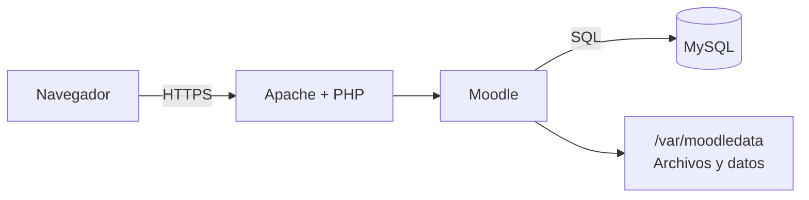

[⌂ Volver al inicio](index.md)

## Índice

- [1. Introducción](#1-introducción)
- [2. Objetivos de la unidad](#2-objetivos-de-la-unidad)
- [3. Criterios de evaluación](#3-criterios-de-evaluación)
- [4. Tipos de gestores de contenidos](#4-tipos-de-gestores-de-contenidos)
- [5. Licencias de uso](#5-licencias-de-uso)
- [6. Moodle y sus requerimientos](#6-moodle-y-sus-requerimientos)
- [7. Instalación de Moodle en Ubuntu Server 2404](#7-instalación-de-moodle-en-ubuntu-server-2404)
- [8. Estructura de Moodle](#8-estructura-de-moodle)
- [9. Creación de contenidos](#9-creación-de-contenidos)
- [10. Personalización de la interfaz](#10-personalización-de-la-interfaz)
- [11. Mecanismos de seguridad](#11-mecanismos-de-seguridad)
- [12. Verificación y rendimiento](#12-verificación-y-rendimiento)
- [13. Publicación](#13-publicación)
- [14. Proyecto práctico](#14-proyecto-práctico)
- [15. Fuentes y documentación](#15-fuentes-y-documentación)

---

## 1. Introducción

Un gestor de contenidos (CMS, *Content Management System*) permite crear, organizar y publicar información desde una interfaz web, sin tener que programar cada página desde cero. En esta unidad implantaremos **Moodle**, un gestor de aprendizaje (LMS, *Learning Management System*), en **Ubuntu Server 24.04 LTS**.

Moodle permite organizar cursos, matricular participantes, publicar recursos, proponer actividades y evaluar el aprendizaje. Para que funcione necesita un servidor web, PHP, una base de datos y un directorio de datos separado del código de la aplicación.

La práctica utilizará la pila Apache, PHP y MySQL. Las versiones concretas de Moodle y sus dependencias deben comprobarse en la documentación oficial antes de cada despliegue: no se debe asumir que una versión antigua sigue recibiendo actualizaciones de seguridad.

## 2. Objetivos de la unidad

- Diferenciar los principales tipos de gestores de contenidos y elegir uno según su finalidad.
- Interpretar las licencias de uso de una aplicación y de sus contenidos.
- Identificar los requisitos de funcionamiento de Moodle.
- Instalar y configurar Moodle en Ubuntu Server 24.04.
- Crear una base de datos y comprender la estructura de directorios de Moodle.
- Crear un curso con recursos y actividades, y adaptar su apariencia.
- Crear un complemento local sencillo en PHP y visualizar su salida dentro de Moodle.
- Aplicar medidas de seguridad, comprobar el funcionamiento y valorar el rendimiento.
- Publicar la plataforma de forma segura y documentar el proceso.

## 3. Criterios de evaluación

Se evaluará que el alumnado sea capaz de:

- Clasificar gestores de contenidos y justificar la elección de Moodle para un entorno educativo.
- Explicar las licencias del software y respetar las condiciones de reutilización de materiales.
- Relacionar Apache, PHP, MySQL, Moodle y el directorio de datos.
- Instalar la aplicación, crear su base de datos y completar su configuración.
- Organizar un curso y añadir contenidos y actividades coherentes.
- Crear una página sencilla mediante un complemento local, usando la API de Moodle y controlando el acceso.
- Personalizar la interfaz sin comprometer la actualización del sistema.
- Aplicar controles básicos de seguridad y realizar pruebas funcionales y de rendimiento.
- Publicar la plataforma mediante HTTPS y aportar evidencias del trabajo realizado.

## 4. Tipos de gestores de contenidos

Los CMS se pueden clasificar atendiendo al uso que se hace de ellos:

| Tipo | Finalidad | Ejemplos |
| --- | --- | --- |
| CMS generalista | Sitios web, noticias, páginas y blogs | WordPress, Drupal, Joomla |
| LMS o gestor de aprendizaje | Cursos, usuarios, actividades y evaluación | Moodle, Canvas |
| Gestor documental | Almacenamiento, clasificación y flujo de documentos | Alfresco, SharePoint |
| CMS desacoplado o *headless* | Gestiona contenidos y los entrega mediante una API a distintos clientes | Strapi, Directus |

Moodle es un LMS: además de publicar páginas, organiza el aprendizaje en cursos y ofrece herramientas de matriculación, seguimiento, comunicación y evaluación. La elección debe basarse en el propósito, el número de usuarios, las integraciones, los conocimientos de administración y los recursos disponibles.

## 5. Licencias de uso

Una licencia establece qué se puede hacer con un programa o con una obra. No se debe confundir que un producto sea gratuito con que carezca de licencia o de condiciones de uso.

- **Software propietario:** el titular conserva el control del código y concede permisos de uso bajo unas condiciones determinadas.
- **Software libre:** permite, conforme a su licencia, usar, estudiar, modificar y redistribuir el programa.
- **Software de código abierto:** ofrece acceso al código y permisos de uso definidos por su licencia; hay que leer las condiciones concretas de cada proyecto.

Moodle se distribuye bajo la licencia **GNU GPL versión 3 o posterior**. Esta licencia permite usar y modificar el programa y redistribuirlo respetando sus condiciones. Los temas, complementos y materiales educativos pueden tener licencias diferentes: hay que comprobarlas por separado. Para contenidos educativos pueden emplearse licencias Creative Commons, que especifican condiciones como atribución, uso no comercial o compartir con la misma licencia.

Antes de instalar un complemento o publicar un recurso, se debe verificar su procedencia, licencia, compatibilidad con la versión instalada y política de actualizaciones.

## 6. Moodle y sus requerimientos

### 6.1 Arquitectura

En nuestra instalación, el navegador solicita una página a Apache. Apache entrega los archivos estáticos o deriva la ejecución de PHP. Moodle ejecuta la lógica de la petición y consulta MySQL para leer o guardar información. Los archivos subidos y otros datos se guardan en un directorio independiente, fuera de la zona pública del servidor web.



### 6.2 Requisitos

Para **Moodle 5.1**, los requisitos mínimos relevantes para esta práctica son:

| Componente | Requisito de Moodle 5.1 | Situación en Ubuntu Server 24.04 |
| --- | --- | --- |
| Sistema | Sistema actualizado y PHP de 64 bits | Ubuntu Server 24.04 LTS es adecuado |
| PHP | Mínimo 8.2.0; se admiten PHP 8.3 y 8.4 | La versión predeterminada es PHP 8.3, compatible |
| Extensión PHP | `sodium` es obligatoria; también se necesitan las extensiones habituales de Moodle | Comprueba las extensiones instaladas para PHP de Apache y CLI |
| Configuración PHP | `max_input_vars` debe ser al menos `5000` | Ajustar en la configuración de PHP usada por Apache |
| Base de datos | MySQL 8.4 como mínimo | Comprueba la versión instalada; MySQL 8.0 no cumple este requisito |
| Codificación de la base de datos | `utf8mb4` | Se configura al crear la base de datos |
| Servidor web | Apache es compatible | Apache HTTP Server está disponible en los repositorios |
| Red para publicación | Dominio y HTTPS para acceso público | Necesita DNS, conectividad entrante y certificado TLS |

Comprueba las versiones realmente instaladas antes de continuar: `php -v` y `mysql --version`; confirma la versión del servidor con `mysql -NBe 'SELECT VERSION();'`. Moodle 5.1 requiere MySQL 8.4 o posterior: si tienes MySQL 8.0, actualízalo antes de instalar Moodle. Verifica también que el PHP de 64 bits está instalado (`php -r 'echo PHP_INT_SIZE * 8, PHP_EOL;'`, que debe mostrar `64`) y que Sodium está disponible (`php -m | grep -i sodium`). Estas comprobaciones de terminal verifican el PHP CLI; el instalador de Moodle permite revisar el PHP que carga Apache. Para un servidor real, dimensiona CPU, memoria y almacenamiento según usuarios concurrentes y volumen de archivos: Moodle no establece una cifra única válida para todos los centros.

## 7. Instalación de Moodle en Ubuntu Server 24.04

La siguiente práctica es una base para un entorno de laboratorio. En producción se debe elegir una rama de Moodle que continúe recibiendo actualizaciones, aplicar HTTPS y adaptar la capacidad del servidor.

### 7.1 Actualizar e instalar los servicios

Como MySQL ya está instalado, no instales otro servidor de base de datos. Actualiza el sistema e instala Apache, Git, PHP y las extensiones necesarias. Asegúrate de que el servidor MySQL existente es 8.4 o posterior y de que PHP cumple los requisitos de Moodle 5.1 antes de continuar.

```bash
sudo apt update
sudo apt upgrade
sudo apt install apache2 git \\
	php libapache2-mod-php php-cli php-mysql php-xml php-curl \
	php-gd php-intl php-mbstring php-soap php-zip php-opcache
sudo systemctl enable --now apache2 mysql
php -v
mysql --version
sudo systemctl status apache2 mysql
```

Comprueba que el servicio `mysql` está activo y que el paquete `php-mysql` está instalado para permitir la conexión desde PHP. En Ubuntu 24.04, el paquete MySQL de los repositorios de Ubuntu puede ser 8.0, versión que no alcanza el mínimo de Moodle 5.1; consulta la versión antes de continuar. Los nombres de algunos paquetes de PHP pueden variar si se utiliza otra versión.

En Ubuntu 24.04, revisa `/etc/php/8.3/apache2/php.ini` y ajusta `max_input_vars` al menos a `5000`. Configura `upload_max_filesize` y `post_max_size` de acuerdo con el tamaño de los archivos que permitirá el curso. Después de modificar PHP, reinicia Apache:

```bash
sudo systemctl restart apache2
```

### 7.2 Crear la base de datos

Accede a MySQL como administrador local:

```bash
sudo mysql
```

En el indicador de MySQL, crea una base de datos y un usuario exclusivos para Moodle. Sustituye la contraseña de ejemplo por una contraseña robusta y única; no la publiques ni la reutilices.

```sql
CREATE DATABASE moodle
	DEFAULT CHARACTER SET utf8mb4
	COLLATE utf8mb4_unicode_ci;
CREATE USER 'moodleuser'@'localhost' IDENTIFIED BY 'CAMBIAR_POR_UN_SECRETO_ROBUSTO';
GRANT ALL PRIVILEGES ON moodle.* TO 'moodleuser'@'localhost';
FLUSH PRIVILEGES;
EXIT;
```

La aplicación debe conectarse con `moodleuser`, no con el usuario administrador de MySQL. Limitar el usuario a `localhost` reduce las conexiones desde otros equipos.

### 7.3 Descargar Moodle y preparar los directorios

Elige una rama estable que esté mantenida y sea compatible con las versiones de PHP y MySQL de este servidor. El nombre de rama del ejemplo es orientativo y debe actualizarse si deja de tener soporte.

```bash
sudo git clone --branch MOODLE_501_STABLE \
	https://github.com/moodle/moodle.git /var/www/moodle
sudo chown -R root:www-data /var/www/moodle
sudo install -d -o www-data -g www-data -m 770 /var/moodledata
```

`/var/moodledata` contiene archivos de usuarios y cursos. Debe estar fuera del directorio público de Apache y ser escribible por el usuario del servicio web. El código de Moodle no necesita permisos de escritura para el servidor web en una instalación normal.

### 7.4 Configurar Apache

En Moodle 5.1, configura el directorio `public` como raíz web. De esta forma no se exponen directamente al navegador otros archivos del código fuente. Si utilizas otra rama, sigue las instrucciones de instalación correspondientes a esa versión.

Crea `/etc/apache2/sites-available/moodle.conf` con una configuración similar a esta. Sustituye `moodle.ejemplo.local` por el nombre DNS del laboratorio o del servidor:

```apache
<VirtualHost *:80>
		ServerName moodle.ejemplo.local
		DocumentRoot /var/www/moodle/public

		<Directory /var/www/moodle/public>
				AllowOverride None
				Options FollowSymLinks
				Require all granted
		</Directory>

		ErrorLog ${APACHE_LOG_DIR}/moodle_error.log
		CustomLog ${APACHE_LOG_DIR}/moodle_access.log combined
</VirtualHost>
```

Activa el sitio y comprueba que la configuración de Apache es válida:

```bash
sudo a2enmod rewrite
sudo a2ensite moodle.conf
sudo a2dissite 000-default.conf
sudo apache2ctl configtest
sudo systemctl reload apache2
```

Si `configtest` no devuelve `Syntax OK`, consulta el mensaje de error y corrige la configuración antes de continuar.

### 7.5 Completar la instalación

Desde un equipo que resuelva el nombre configurado, abre `http://moodle.ejemplo.local` y sigue el instalador. Selecciona el idioma, confirma las rutas y proporciona los datos de conexión a MySQL:

- Tipo de base de datos: MySQL mejorado (controlador `mysqli`).
- Servidor: `localhost`.
- Base de datos: `moodle`.
- Usuario: `moodleuser`.
- Contraseña: la definida al crear el usuario.
- Directorio de datos: `/var/moodledata`.

Completa la configuración del sitio y crea una cuenta de administración con una contraseña única. No reutilices las credenciales de la base de datos. Al finalizar, verifica que Moodle recomienda eliminar o proteger el instalador y que el directorio de datos no es accesible mediante una URL.

### 7.6 Configurar las tareas programadas

Moodle necesita ejecutar tareas periódicas para enviar notificaciones, procesar tareas y mantener el sitio. Configura el cron para que se ejecute cada minuto como `www-data`:

```bash
sudo crontab -u www-data -e
```

Añade esta línea:

```cron
* * * * * /usr/bin/php /var/www/moodle/admin/cli/cron.php >/dev/null
```

En el área de administración, comprueba después que la última ejecución del cron es reciente y que no hay tareas atascadas.

## 8. Estructura de Moodle

En la instalación se distinguen tres ubicaciones importantes:

- **Código de Moodle** (`/var/www/moodle`): aplicación, complementos y temas. Apache publica únicamente la raíz web indicada para la versión instalada.
- **Directorio de datos** (`/var/moodledata`): archivos subidos, cachés y otros datos. No debe estar dentro de la raíz pública ni servirse directamente por HTTP.
- **Base de datos** (`moodle`): usuarios, cursos, actividades, configuración y referencias a los archivos.

En la plataforma, la organización habitual es **categorías > cursos > secciones o temas > recursos y actividades**. Las categorías agrupan cursos; las secciones estructuran cada curso; los recursos presentan información y las actividades requieren una participación del alumnado.

## 9. Creación de contenidos

Una vez iniciada la sesión como administrador:

1. Crea una categoría para el departamento o nivel educativo.
2. Crea un curso y define nombre, descripción, formato, fechas y método de matriculación.
3. Añade secciones con una secuencia de aprendizaje clara.
4. Incorpora recursos: archivos, páginas, enlaces, libros o etiquetas.
5. Añade actividades: tareas, cuestionarios, foros, consultas o talleres.
6. Matricula participantes con los roles adecuados y revisa el curso con el rol de estudiante.

Utiliza nombres descriptivos, formatos accesibles y materiales cuya licencia permita su uso. Evita subir datos personales que no sean necesarios y limita el tamaño de los archivos a lo requerido por la actividad.

## 10. Personalización de la interfaz

Desde la administración del sitio se puede seleccionar un tema, configurar el logotipo, los colores, la página principal, los bloques y los formatos de curso. La personalización debe mejorar la legibilidad y la navegación, y mantener una experiencia usable desde móvil.

Antes de instalar un tema o complemento, comprueba que sea compatible con la versión de Moodle, que proceda de una fuente fiable y que tenga mantenimiento activo. Conserva una copia de seguridad antes de actualizarlo. No modifiques directamente los archivos del núcleo: las actualizaciones podrían sobrescribir los cambios.

### 10.1. Cambiar el tema desde Moodle

El tema se cambia desde la administración del sitio, sin escribir PHP:

1. Inicia sesión con una cuenta de administrador.
2. Abre **Administración del sitio > Apariencia > Temas > Selector de temas**.
3. Selecciona el tema disponible y pulsa **Cambiar tema**. Si aparecen opciones para escritorio y móvil, selecciona el tema en cada apartado.
4. Comprueba la portada, un curso y una actividad con distintos tamaños de pantalla.

Para instalar un tema que todavía no está disponible, descárgalo del directorio oficial de plugins de Moodle y comprueba que sea compatible con Moodle 5.1. Instálalo desde **Administración del sitio > Plugins > Instalar plugins** y, cuando Moodle lo haya detectado, selecciónalo desde el selector de temas.

Si solo se quieren cambiar colores, logotipo o tipografía, revisa primero las opciones de configuración del tema instalado. En **Boost**, se pueden personalizar estilos desde su configuración avanzada, por ejemplo cargando un preset o utilizando el campo **Raw SCSS** si está disponible. Esto es SCSS/CSS, no PHP. Después de cambiar el tema o sus estilos, purga las cachés de Moodle y verifica el resultado como docente y estudiante.

No edites directamente los archivos del núcleo ni los del tema instalado: las actualizaciones pueden sobrescribir esos cambios. Para una personalización extensa, crea un tema hijo o un tema propio siguiendo las API de Moodle.

### 10.2. Ejercicio: programación básica en PHP para Moodle

PHP no se escribe en una etiqueta o recurso del curso para ejecutarlo. Para que el código se ejecute de forma integrada y segura, se crea un complemento. En esta práctica construiremos un **complemento local** que genera una página de Moodle con un saludo y la fecha del servidor. El aviso aparecerá con el estilo del tema activo.

En Moodle 5.1, crea la carpeta `saludo` dentro de `public/local/`. El componente se llamará `local_saludo` y tendrá esta estructura:

```text
public/local/saludo/
|-- version.php
|-- index.php
|-- lang/
	|-- en/local_saludo.php
	|-- es/local_saludo.php
```

#### Archivo `version.php`

Este archivo identifica el complemento y declara la versión mínima de Moodle compatible:

```php
<?php
defined('MOODLE_INTERNAL') || die();

$plugin->component = 'local_saludo';
$plugin->version = 2026100300;
$plugin->requires = 2025100600;
```

#### Archivo `index.php`

La página carga Moodle, exige que el usuario haya iniciado sesión y utiliza el sistema de salida de Moodle para mostrar el contenido:

```php
<?php
require(__DIR__ . '/../../../config.php');
require_login();

$context = context_system::instance();
$PAGE->set_context($context);
$PAGE->set_url(new moodle_url('/local/saludo/index.php'));
$PAGE->set_title(get_string('pluginname', 'local_saludo'));
$PAGE->set_heading(get_string('pluginname', 'local_saludo'));

echo $OUTPUT->header();
echo $OUTPUT->heading(get_string('heading', 'local_saludo'));
echo $OUTPUT->notification(
	s(get_string('welcome', 'local_saludo', fullname($USER))),
	\core\output\notification::NOTIFY_INFO
);
echo html_writer::div(s(get_string('serverdate', 'local_saludo', userdate(time()))));
echo $OUTPUT->footer();
```

#### Archivos de idioma

En `lang/es/local_saludo.php` añade:

```php
<?php
$string['pluginname'] = 'Saludo PHP';
$string['heading'] = 'Una página generada con PHP';
$string['welcome'] = '¡Hola, {$a}! Este mensaje lo genera un complemento de Moodle.';
$string['serverdate'] = 'Fecha y hora del servidor: {$a}';
```

En `lang/en/local_saludo.php` añade las cadenas de reserva:

```php
<?php
$string['pluginname'] = 'PHP greeting';
$string['heading'] = 'A page generated with PHP';
$string['welcome'] = 'Hello, {$a}! This message is generated by a Moodle plugin.';
$string['serverdate'] = 'Server date and time: {$a}';
```

#### Instalación y prueba

1. Copia la carpeta `saludo` a `/var/www/moodle/public/local/saludo`, conservando los permisos de lectura del servidor web. No hagas escribible todo el código de Moodle por `www-data`.
2. Inicia sesión como administrador y abre `/admin/index.php` para que Moodle detecte e instale el complemento.
3. Abre `https://tu-dominio/local/saludo/index.php` (o la URL correspondiente a tu laboratorio).
4. Comprueba que Moodle muestra el saludo, el aviso con el estilo del tema y la fecha. Cambia el texto del saludo, purga las cachés si es necesario y verifica el cambio.
5. Cierra la sesión e intenta acceder de nuevo: `require_login()` debe redirigir a la página de acceso.

La práctica enseña cómo PHP produce contenido dentro de Moodle. Si el objetivo es cambiar los colores de toda la plataforma, se debe personalizar el tema mediante sus opciones y CSS/SCSS, no intentar hacerlo insertando PHP en el contenido del curso. No modifiques los archivos del núcleo ni permitas ejecutar scripts PHP subidos como recursos.

## 11. Mecanismos de seguridad

Moodle incluye mecanismos de autenticación, roles y capacidades, permisos por contexto, gestión de sesiones, validación de formularios y registro de eventos. Estas funciones deben configurarse correctamente y complementarse con la seguridad del servidor:

- Mantener Ubuntu, Moodle, temas y complementos actualizados.
- Publicar el sitio mediante HTTPS y redirigir HTTP a HTTPS.
- Utilizar contraseñas robustas, limitar las cuentas administrativas y revisar los métodos de autenticación.
- Asignar el mínimo de permisos necesario y no compartir cuentas.
- Mantener `moodledata` fuera de la raíz pública y restringir sus permisos.
- Restringir puertos con el cortafuegos; exponer solo los servicios necesarios, normalmente SSH y HTTPS.
- Realizar copias de seguridad de la base de datos y de `moodledata`, y probar su restauración.
- Revisar registros de Apache, tareas programadas, alertas y eventos de seguridad.
- No instalar complementos sin verificar su origen y compatibilidad.

La licencia de software libre no sustituye las obligaciones de privacidad, protección de datos ni las políticas del centro.

## 12. Verificación y rendimiento

La instalación se considera operativa cuando se puede acceder, iniciar sesión, navegar por un curso, abrir recursos, completar una actividad y guardar los resultados. También hay que verificar el cron, la conexión con la base de datos y la carga de archivos.

Comprobaciones básicas en el servidor:

```bash
sudo systemctl is-active apache2 mysql
sudo apache2ctl configtest
curl -I http://moodle.ejemplo.local
sudo tail -n 50 /var/log/apache2/moodle_error.log
```

En Moodle, revisa **Administración del sitio > Servidor > Entorno** y el estado de las tareas programadas. Corrige las advertencias de requisitos antes de publicar. Para evaluar rendimiento, registra el tiempo de respuesta y el uso de CPU, memoria, disco y base de datos durante una prueba representativa; aumenta usuarios gradualmente y observa cuándo aparecen errores o degradación. No realices pruebas de carga contra sistemas ajenos ni contra producción sin autorización.

El rendimiento también depende de la caché, el almacenamiento, la configuración de PHP, el tamaño de los cursos, las consultas a la base de datos y el número de usuarios simultáneos. Cualquier cambio debe medirse antes y después.

## 13. Publicación

Para publicar Moodle en Internet se necesita un dominio que resuelva a la dirección del servidor, reglas de red adecuadas y un certificado TLS válido. En un dominio real, Certbot puede automatizar la configuración de HTTPS para Apache:

```bash
sudo apt install certbot python3-certbot-apache
sudo certbot --apache -d aula.ejemplo.org
```

El dominio del ejemplo debe sustituirse por uno real configurado previamente. No se puede obtener un certificado público para un nombre ficticio o exclusivamente local. Comprueba la renovación automática del certificado y configura en Moodle la URL pública `https://aula.ejemplo.org`.

Antes de anunciar el sitio, verifica desde una red externa el acceso HTTPS, el inicio de sesión, la carga de recursos, los permisos, las copias de seguridad y la ausencia de errores. Documenta la versión instalada, los cambios realizados, las cuentas entregadas de forma segura y el procedimiento de recuperación.

## 14. Proyecto práctico

Instala Moodle en una máquina virtual con Ubuntu Server 24.04 y prepara un curso de demostración. Entrega:

- Un esquema de la arquitectura y una tabla con las versiones de los componentes.
- Evidencias de la creación de la base de datos y de la configuración de Moodle, sin mostrar contraseñas.
- Un curso con al menos tres secciones, dos recursos y dos actividades.
- El complemento `local_saludo` instalado y capturas de la página generada; incluye una breve explicación de `require_login()` y de cómo Moodle muestra el resultado.
- Una personalización visual y una explicación de la licencia de los materiales utilizados.
- Una lista de comprobaciones de seguridad y funcionamiento, con resultados.
- Una prueba sencilla de rendimiento, indicando método, carga aplicada y observaciones.
- Una publicación HTTPS, si se dispone de dominio; en caso contrario, documenta qué elementos faltan para publicarla de forma segura.
- Una breve guía para actualizar y restaurar la plataforma.

## 15. Fuentes y documentación

- [Documentación oficial de Moodle](https://docs.moodle.org/)
- [Desarrollo de complementos locales en Moodle 5.1](https://moodledev.io/docs/5.1/apis/plugintypes/local)
- [Requisitos de servidor de Moodle 5.1](https://moodledev.io/general/releases/5.1#server-requirements)
- [Requisitos del servidor Moodle](https://docs.moodle.org/501/en/Server_requirements)
- [Instalación de Moodle](https://docs.moodle.org/501/en/Installing_Moodle)
- [Documentación de Ubuntu Server](https://documentation.ubuntu.com/server/)
- [Licencia GNU GPL](https://www.gnu.org/licenses/gpl-3.0.html)